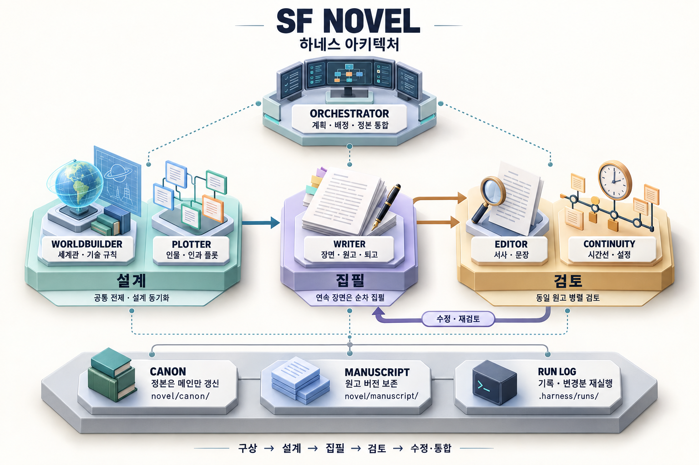

# SF 소설 집필 작업실

한국어 SF 소설을 구상하고 집필·퇴고하기 위한 프로젝트입니다. 소재·분량·문체는 아직 미정입니다.



메인 세션이 계획·배정·정본 통합을 맡고, 5개 전문 역할이 설계·집필·검토를 수행합니다. 검토 결과는 집필자에게 돌아가 수정되며, 원고 버전과 실행 기록은 보존됩니다.

## 바로 시작하기

이 폴더에서 다음처럼 요청하면 됩니다.

- “SF 소설 아이디어를 세 가지 제안해줘. 쓸쓸하지만 희망적인 분위기면 좋겠어.”
- “기억을 거래하는 도시를 배경으로 주인공과 갈등을 설계해줘.”
- “현재 설정과 플롯을 읽고 첫 장면을 써줘.”
- “이 원고의 시간선과 인물 지식에 모순이 있는지 검토해줘.”
- “주인공의 선택을 바꿨어. 영향을 받는 장면만 수정해줘.”

[집필 브리프](novel/brief.md)는 선택사항부터 채워도 됩니다. 작품의 중요한 결정만 함께 정하고 나머지는 작업 가정으로 구분합니다.

## 작업 흐름

구상 → 공통 전제 → 세계관·인물·인과 플롯 → 장면 집필 → 서사·문장/설정·과학 검토 → 수정본.

[집필 총괄 스킬](.agents/skills/sf-novel-orchestrator/SKILL.md)이 진행 상황을 읽고 필요한 역할만 사용합니다. 세계관 설계자, 플롯 설계자, 집필자, 편집 검토자, 연속성 검토자 총 5개 역할이 있습니다. 정본은 메인 세션이 관리하고 작업자는 배정된 출력만 작성합니다.

| 경로 | 용도 |
| --- | --- |
| `novel/brief.md` | 목표와 선호, 미정 항목 |
| `novel/canon/` | 세계관·인물·시간선·문체·결정 기록 |
| `novel/outline/plot.md` | 플롯, 장면 카드, 복선 |
| `novel/manuscript/` | 통합 원고의 버전별 파일 |
| `novel/reviews/` | 해당 원고 버전의 검토·수정 기록 |
| `.harness/runs/` | 로컬 실행별 입력·출력·검증·재실행 기록 |

이전 원고와 작업 기록을 보존하며 설정이 바뀌면 영향을 받는 부분을 다시 검토합니다. 과학적 사실, 외삽, 창작 가정을 구별합니다.

## 하네스 관리

하네스 수정은 `$harness`, 집필은 `$sf-novel-orchestrator`로 요청할 수 있습니다. 새 역할·스킬이 목록에 나타나지 않으면 새 세션에서 이 폴더를 열거나 `AGENTS.md`가 가리키는 스킬을 직접 읽게 하세요. 현재 세션에서 새 커스텀 역할의 자동 발견을 가정하지 않습니다.

```bash
python3 .agents/skills/harness/scripts/validate.py --project .
```

이는 구조 검사입니다. 실행·검토 기록은 로컬의 `.harness/runs/`에 저장합니다. `.harness/`와 `_workspace/`의 내부 실행 기록 및 캐시는 Git에 포함하지 않습니다. 공유할 원고와 검토 결과는 `novel/`에 보관합니다. 모델·전역 설정은 변경하지 않습니다.
